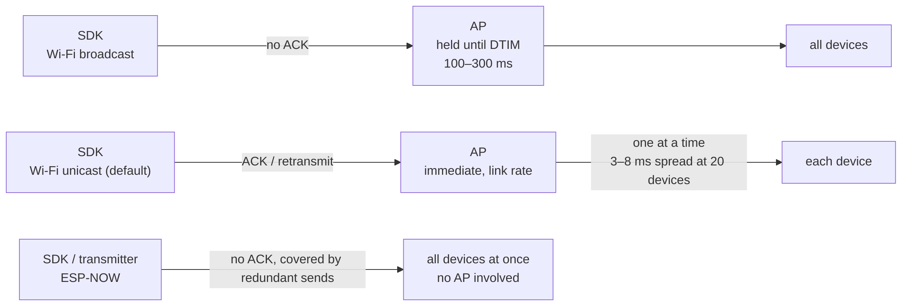

Hapbeat haptic events reach the device over the network. This page explains the design decisions behind the **standard path (Wi-Fi UDP unicast)** and the **upper-tier option (ESP-NOW)**.

## Standard: Wi-Fi UDP Unicast

```
SDK / app
  ↓ UDP unicast (one packet per known device)
Hapbeat devices (each self-filters by group / player in the received target)
```

The SDK sends haptic events by **unicast** to the IP of each discovered device. Each device inspects the **target (group / player)** in the received packet and decides whether to play or ignore it.

### Why Unicast Instead of Broadcast?

Wi-Fi broadcast (group-addressed frames) carries a delay factor the sender cannot avoid.

- **DTIM buffering** — if **even one** power-saving station is associated with the same access point, the AP holds group-addressed frames until the next DTIM beacon. The interval is on the order of **100–300 ms**, and the **sender has no control over it**. Hapbeat devices themselves disable power saving, but the buffering is caused by unrelated nearby devices (phones, etc.), so it cannot be prevented from the Hapbeat side.
- **No ACK or retransmission** — broadcast frames have no MAC-layer ACK or retransmission, and they are sent at the lowest basic rate, so they are more loss-prone and occupy the air longer.
- **Unicast is faster** — it has MAC-layer ACK plus retransmission and is sent at the (much higher) link rate. **Up to roughly 10 devices, total airtime is even shorter than broadcast.**

So it is not the case that "broadcast is fine on a dedicated AP" — **unicast is the best choice in every environment**, and there is no need to switch based on the environment.

### The Weakness of Unicast, and How the SDK Covers It

Unicast requires the sender to know the destination IP. The SDK compensates as follows:

- **When zero devices are known, it falls back to broadcast**, so haptics still arrive before anything has been discovered.
- Devices announce themselves with a PONG right after joining Wi-Fi, so a power-cycled unit becomes known again quickly. (Note: this behavior applies once the corresponding firmware support ships. At present, devices are discovered by the SDK's periodic PING.)
- **Nothing changes from the user's point of view.** You still specify a target and send; the device decides whether it applies. Only the delivery mechanism inside the SDK changed — no EventMap or API changes.

### Device Count and Simultaneity

Unicast sends to each device in turn, so there is a time offset between the first and last unit. Airtime per packet is roughly **150–300 µs** (on the order of 500 µs when the band is busy).

The figures below are **calculated from how 802.11 works — they are not measured values.** Treat them as rough guidance.

| Devices | First-to-last offset (calculated estimate) |
|---|---|
| 2 | 0.2–0.5 ms |
| 5 | 0.8–2 ms |
| 10 | 1.5–4 ms |
| 20 | 3–8 ms |
| 50 | 8–20 ms |
| 100 | 15–40 ms |

Haptic simultaneity is generally hard to perceive within **10–20 ms**. **Up to 20 devices there is no practical problem**; at 50 it depends on conditions; at 100 the offset can become perceptible.

When strict simultaneity is required, use **`target_time` (scheduled playback)**: send a slightly future timestamp to every device and they all fire together regardless of arrival order (device-side support is already implemented). This requires clock alignment between sender and devices, so **large-scale simultaneous playback needs case-by-case design work**. See [Key to Low Latency: targetTime](#key-to-low-latency-targettime) below.

### Comparing the Three Paths



### Why No Application-Layer ACK?

Hapbeat uses plain UDP with no application-layer ACK or retransmission (with unicast, the MAC-layer ACK and retransmission still apply). This is an intentional choice:

> **For haptics, a missed packet is better than a late one.**

In a game, a sound effect that drops for one frame is far less disruptive than one that arrives 200 ms late due to network delay. Adding application-layer ACK/retransmit would increase latency variance, so Hapbeat prioritizes consistent, fixed latency.

### Constraints

- **Same subnet required** — device discovery (mDNS) and the broadcast fallback do not cross routers
- **2.4 GHz Wi-Fi only** (ESP32 limitation)
- **VR HMDs have no AP capability**, so in router-less environments **Hapbeat itself acts as a SoftAP** (see below)

## Connection Scenarios

| Scenario | Configuration | Use case |
|---|---|---|
| **A. Single-player LAN** (recommended) | Standard router, no Group specified | Home / office |
| **B. Multi-player LAN** | Router, unique group/player ID per player | Multiple players on the same LAN |
| **C. Mobile hotspot** | Smartphone / PC tethering (force 2.4 GHz) | On the go / travel |
| **D. Hapbeat SoftAP** | One Hapbeat acts as AP; HMD + other Hapbeats connect as STA | Router-less environments (Quest, etc.) |
| **E. Isolated booth** | Independent AP per booth, equivalent to B | Events / exhibitions |

Details: [](/en/docs/tools/studio/initial-setup/) / [](/en/docs/hardware/overview/#softap-mode)

## Upper-Tier Option: ESP-NOW Path

For scales that Wi-Fi unicast cannot handle (dozens of simultaneous devices) or environments without Wi-Fi, an **ESP-NOW** routing option is available.

```
SDK / app
  ↓ UDP / OSC
hapbeat-bridge (PC / host)
  ↓ serial
hapbeat-transmitter-firmware (ESP32 transmitter)
  ↓ ESP-NOW (2.4 GHz radio, no AP required)
Hapbeat devices (multiple, simultaneously)
```

- The **Transmitter** broadcasts via ESP-NOW to multiple Hapbeat devices
- The **Bridge** handles the host-side control plane (UDP/OSC receive, device registry, time sync)
- No router or AP needed — uses only the raw ESP-NOW radio band

ESP-NOW scales well not "because it is broadcast," but because **it never goes through an AP**: there is no DTIM buffering, and a single transmission reaches every device at the same time, independent of device count. In exchange there is no ACK or retransmission, so the design **compensates for loss with redundant sends spread over time**.

For typical use cases Wi-Fi unicast is sufficient, so the ESP-NOW path is used only for large-scale performances, Wi-Fi-free environments, or when a dedicated Hapbeat network is required.

## Why Not Use Bluetooth as the Primary Path?

Previous v1 hardware used Bluetooth, but it was replaced with Wi-Fi UDP for the following reasons:

- **Pairing management is cumbersome** — experience degrades across multiple devices and platforms
- **Poor at broadcasting** — BLE Advertising is inferior to UDP in bandwidth and packet rate
- **Fragmented APIs across PC / Quest / smartphone** — BLE implementation varies too much per OS
- **Limited concurrent connections** — Central-side link count ceiling

The current BT firmware (`hapbeat-bt-firmware`) is maintained for v1 compatibility, but new users are expected to use the Wi-Fi models (Duo WL / Band WL).

## Key to Low Latency: targetTime

Hapbeat supports a **targetTime (future fire timestamp)** to absorb latency. Instead of "fire now," the SDK sends "fire in 100 ms," and the device uses its time-synchronized clock to play back at exactly that moment.

This keeps fire timing stable even in the presence of network jitter. See [](/en/docs/concepts/contracts/overview/) for details.

## Choosing a Path

| Scale / requirement | Recommended |
|---|---|
| Up to ~20 devices (most projects) | **Unicast** (the default — no configuration needed) |
| Strict simultaneous firing required | Unicast + `target_time` |
| Dozens of devices or more | ESP-NOW |

## See Also

- [Architecture Overview](/en/docs/concepts/architecture/)
- [Address System](/en/docs/concepts/group-player-addressing/) (planned)
- [](/en/docs/tools/studio/initial-setup/)
