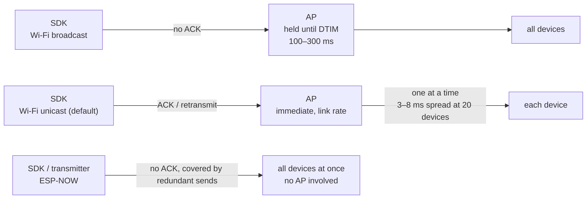

Hapbeat haptic events reach the device over **Wi-Fi UDP unicast**. The SDK sends to the IP of each discovered device one at a time, and each device inspects the **target (player / group)** in the packet to decide whether it is the addressee.

**This path is enabled by default and needs no configuration.** There is nothing to switch based on your environment.

## Choosing a path

| Scale / requirement | What to use |
|---|---|
| Up to ~20 devices (most projects) | **Wi-Fi unicast** (default, no configuration) |
| Strict simultaneous firing required | Wi-Fi unicast + `target_time` |
| Dozens of devices or more, or no Wi-Fi available | ESP-NOW ([below](#upper-tier-option-esp-now)) |

## Device count and simultaneity

Unicast sends to each device in turn, so there is a time offset between the first and the last unit.

| Devices | First-to-last offset |
|---|---|
| 2 | 0.2–0.5 ms |
| 5 | 0.8–2 ms |
| 10 | 1.5–4 ms |
| 20 | 3–8 ms |
| 50 | 8–20 ms |
| 100 | 15–40 ms |

Haptic simultaneity is generally said to be **hard to perceive within 10–20 ms**. **Up to 20 devices there is no practical problem**; at 50 it depends on conditions; at 100 the offset enters the range where it can be felt.

:::note
The table above consists of **calculated values derived from how 802.11 works — they are not measured values** (assuming 150–300 µs of airtime per packet, on the order of 500 µs when the band is busy). Treat them as rough guidance.
:::

### When strict simultaneity is required

Use **`target_time` (scheduled playback)**. Send a slightly future timestamp to every device and they all fire together regardless of arrival order. The SDK sends "fire in 100 ms" rather than "fire now," and the device plays back at that moment using its own time-synchronized clock, so fire timing stays stable even with network jitter.

It does require clock alignment between the sender and the devices, so **large-scale simultaneous playback needs case-by-case design work**.

## Constraints

- **Same subnet required** — device discovery (mDNS) does not cross routers
- **2.4 GHz Wi-Fi only** (ESP32 limitation)
- **VR HMDs have no AP capability** — in router-less environments the Hapbeat itself becomes a SoftAP
- **You cannot unicast to an undiscovered device** — when zero devices are known it falls back to broadcast, so haptics arrive even right after startup

## Connection scenarios

| Scenario | Configuration | Use case |
|---|---|---|
| **A. Single-player LAN** (recommended) | Standard router | Home / office |
| **B. Multi-player LAN** | Router, unique player / group per player | Multiple players on the same LAN |
| **C. Mobile hotspot** | Smartphone / PC tethering (force 2.4 GHz) | On the go / travel |
| **D. Hapbeat SoftAP** | One Hapbeat acts as AP; HMD + other Hapbeats connect as STA | Router-less environments (Quest etc.) |
| **E. Isolated booth** | Independent AP per booth, equivalent to B | Events / exhibitions |

Details: [](/en/docs/tools/studio/initial-setup/) / [](/en/docs/hardware/overview/#switching-softap-mode)

## Upper-tier option: ESP-NOW

For dozens of simultaneous devices, or environments without Wi-Fi, use the **ESP-NOW** path.

```
SDK / app
  ↓ UDP / OSC
hapbeat-bridge (PC / host)
  ↓ serial
hapbeat-transmitter-firmware (ESP32 transmitter)
  ↓ ESP-NOW (2.4 GHz radio, no AP required)
Hapbeat devices (multiple, simultaneously)
```

**Because it never goes through an AP, a single transmission reaches every device at once, independent of device count.** In exchange there is no ACK or retransmission, so the design compensates for loss with redundant sends spread over time. No router and no AP are needed.

Wi-Fi unicast is sufficient for typical use, so ESP-NOW is adopted for large-scale performances, Wi-Fi-free environments, or when you want a dedicated Hapbeat network.

---

## Design background

The rest of this page is supplementary, for readers who want to know how it works. You do not need it for a normal deployment.

### Why unicast instead of broadcast

Wi-Fi broadcast (group-addressed frames) carries delay factors the sender cannot avoid.

- **DTIM buffering** — if **even one** power-saving station is associated with the same AP, the AP holds group-addressed frames until the next DTIM beacon. The interval is on the order of **100–300 ms** and the sender has no control over it. Hapbeat devices themselves disable power saving, but the buffering is caused by unrelated nearby devices (phones etc.), so it cannot be prevented from the device side
- **No ACK or retransmission** — broadcast is sent at the lowest basic rate, so it is loss-prone and occupies the air longer
- **Unicast is faster** — it has MAC-layer ACK plus retransmission and flies at the link rate. Up to roughly 10 devices, total airtime is even shorter than broadcast

So it is not the case that "broadcast is fine on a dedicated AP" — **unicast is the best choice in every environment**.



### Why there is no application-layer ACK

> **For haptics, a missed packet is better than a late one.**

A sound effect in a game breaks the experience far less by dropping for one occurrence than by arriving 200 ms late. Application-layer ACK and retransmission would increase latency variance, so Hapbeat prioritizes fixed latency (with unicast, the MAC-layer ACK and retransmission still apply).

### Why Bluetooth is not the primary path

v1 used Bluetooth, but we moved to Wi-Fi UDP because of cumbersome pairing management, poor broadcasting, fragmented APIs across PC / Quest / smartphone, and limits on concurrent connections. The current BT firmware remains for v1 compatibility, but new users are expected to use the Wi-Fi models (Duo WL / Band WL).

## See also

- [](/en/docs/concepts/architecture/)
- [](/en/docs/concepts/group-player-addressing/)
- [](/en/docs/tools/studio/initial-setup/)
