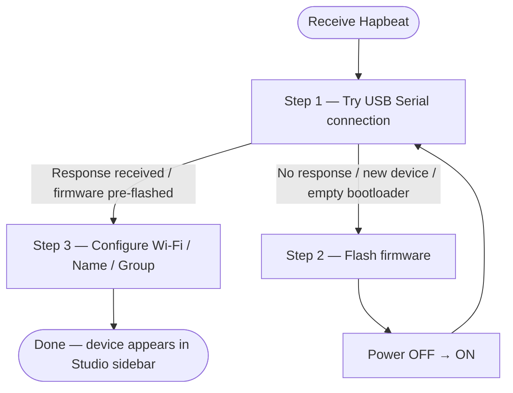

This page covers everything you need to do to get Hapbeat working for the first time. **The onboarding wizard displayed on the right side of Studio's Manage tab** will guide you through each step. Once connected to Wi-Fi, you won't need a USB cable again.

> 💡 Flash the firmware over USB and configure Wi-Fi once. From then on, simply power on the device and it will appear in Studio automatically via LAN/Wi-Fi.

## What You Need

- **Hapbeat device** (Necklace / Band)
- **USB cable** (USB-C cable capable of data transfer — charge-only cables will not work)
- **PC** (Windows / macOS / Linux, Chrome or Edge browser)
- **Wi-Fi network** (2.4 GHz required; SSID and password)
- **`hapbeat-helper`** installed and running (`pipx install hapbeat-helper`)

## Overall Workflow

## Step 0: Open Studio and Start Helper

1. Open Studio in your browser: <https://devtools.hapbeat.com/studio/>
2. Confirm that `hapbeat-helper` is running. For first-time setup, register it for auto-start with `hapbeat-helper install-service` (recommended), or start it manually with `hapbeat-helper start`. A green **"Helper connected"** badge at the top of Studio means it is running.
   - The green badge is clickable and opens the Helper Manage modal (version info and restart commands).
   - A red **"Helper disconnected"** badge opens an installation instructions modal when clicked.
3. Click the **Manage tab**. If no devices are listed in the sidebar, the onboarding wizard will appear on the right.

## Step 1: Connect via USB Serial

Connections are made from the **"USB Serial" section in the left sidebar** (there is no connect button in the wizard itself).

1. Connect Hapbeat to your PC with a **USB cable**.
2. Press the **＋ button** in the left sidebar's "USB Serial" section and select the Hapbeat port in the COM port dialog.
   - An approved COM port will be reused automatically in subsequent sessions.
   - Multiple Hapbeat devices each appear as a separate card (`#1`, `#2`, …).
3. **Check the ✔ checkbox** on the card to connect.

### Two Possible Outcomes (Automatic)

Once connected, the wizard automatically advances based on the device's response.

- ✅ **Firmware present** → advances to **Step 3 (Wi-Fi setup)**.
- ⚠️ **No response** (new device / empty bootloader) → advances to **Step 2 (firmware flash)**.

## Step 2: Flash Firmware (Only If No Response)

> Devices that already have firmware from the factory **do not need this step** — the response check in Step 1 will skip it.

1. In the wizard, select **Hapbeat** under "Node type" and pick your variant (Necklace / Band).
2. Click **"Serial flash"**.
3. Select your device in the browser's COM port selection dialog.
4. Wait for the progress bar to complete (approximately 30 seconds to 1 minute).
   - Leave the "Use compression" checkbox **OFF** for stability (there is a known issue where 921600 baud + compression can fail with `status 201`).
5. **Once flashing is complete**, power Hapbeat OFF and then ON. Then **re-check the USB Serial card's checkbox** in the left sidebar to reconnect.
   - If it advances to Step 3, you are done.

### Troubleshooting Step 2

- Stuck at `status 201` (`ESP_TOO_MUCH_DATA`): Try a different USB port, cable, or hub.
- "Web Serial API not supported": Use Chrome or Edge (Firefox and Safari are not supported).
- Step 1 still shows no response after multiple flashing attempts: Hold the device's reset button for 5 or more seconds, then retry Step 1.

## Step 3: Configure Wi-Fi / Name / Group

The wizard opens the Wi-Fi settings panel.

1. **Device identity**: Optionally rename the device (e.g., `hapbeat-living`). The default name is fine to keep.
2. **Wi-Fi settings → + Add new**: Enter the SSID and password, then click **"Add"**.
3. In the profile list, click the **"Connect"** button for that SSID.
4. Once the device connects to Wi-Fi, the status at the top changes to **"Connected · SSID=…"**.
5. Within a few seconds, **the device automatically appears in the left sidebar** — initial setup is complete 🎉

> 💡 Once Wi-Fi connectivity is confirmed, **you can unplug the USB cable**. From this point on, the device will automatically reconnect to Wi-Fi on power-up and appear in Studio.

## After Setup

- Select your Hapbeat in the Manage tab's left sidebar to **install Kits**, **update firmware (OTA)**, **configure LED and volume settings**, and **add or remove Wi-Fi profiles**.
- Traveling to a location with a different Wi-Fi network: simply add another SSID under Studio → Manage → Settings → Wi-Fi (up to 5 profiles can be saved).
- To build a **sensor → broker → Hapbeat MQTT alert** setup, continue to [Set Up MQTT Alerts](/en/docs/tools/studio/mqtt-alerts/).

## Troubleshooting

| Symptom | Fix |
|---|---|
| "Helper connected" not shown | Run `pipx install hapbeat-helper`, then start `hapbeat-helper` from a terminal |
| No COM port listed in Step 1 | Verify that the USB cable supports data transfer (not charge-only) / try a different USB port |
| Flash fails with `status 201` | Try a different USB port / USB cable / USB hub |
| Wi-Fi does not connect (`ssid not found`) | 5 GHz-only SSIDs are not supported; select a 2.4 GHz SSID |
| Device does not appear in sidebar | Wait several seconds / restart Helper / power cycle Hapbeat |

Implementation note: The wizard component is `src/components/devices/OnboardingWizard.tsx`. All serial connections within Studio go through the single master store `src/stores/serialMaster.ts` (the Web Serial API allows only one owner per port, so Studio uses a single master globally). The underlying Serial communication layer is in `src/utils/serialConfig.ts` (line-based JSON protocol) and `src/utils/serialFlasher.ts` (esptool-js wrapper).
