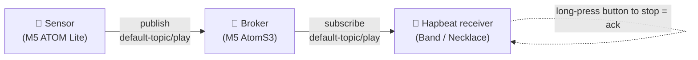

When a sensor detects a color (state), it triggers a Hapbeat (wearable device) over MQTT to vibrate and **loop until stopped with a button** — the shortest path to a facility alert for hospitals and care settings where the wearer "must be notified."

This setup consists of three nodes.

| Role | Hardware | Firmware type (Studio) | Job |
|---|---|---|---|
| **Sensor** | M5 ATOM Lite + color sensor | Peripheral → Sensor transmitter | Detects a color and publishes to `<topic>/play` |
| **Broker** | M5 AtomS3 | Peripheral → Broker | The MQTT broker itself (relay). Advertises via mDNS |
| **Receiver (Hapbeat)** | Band / Necklace | Hapbeat | Subscribes to `<topic>/play`; vibrates, shows OLED, alerts |

> 💡 First complete [initial setup (serial connect → firmware flash → Wi-Fi)](/en/docs/tools/studio/initial-setup/) for all three nodes, then proceed to the MQTT configuration on this page. They must be on the same Wi-Fi (same LAN).

## What You Need

- **Sensor** (M5 ATOM Lite + color sensor) × 1
- **Broker** (M5 AtomS3) × 1
- **Hapbeat receiver** (Band / Necklace) × 1 or more
- **USB cable** (data-capable), **PC** (Chrome / Edge), **2.4 GHz Wi-Fi**
- **`hapbeat-helper`** running (see [initial setup](/en/docs/tools/studio/initial-setup/))
- A **Kit** for the receiver (alert events, e.g. `urgent` / `calm` in `alert-kit`)

## Overall Flow

1. Configure the **broker** first (setting it up early makes later auto-discovery easy)
2. Configure the **receiver (Hapbeat)** (auto-detect broker → subscribe topics → alert behavior)
3. Configure the **sensor** (auto-detect broker → color → event mapping)
4. **Test end to end** (detect a color → receiver vibrates → stop with the button)

For each node, you "connect over USB, configure, then move it onto Wi-Fi and unplug USB." Connect by **pressing ＋ in the left "USB Serial" section and checking the card's checkbox ✔** (same as [initial setup](/en/docs/tools/studio/initial-setup/)).

---

## Part 1: Configure the Broker

1. Connect the broker (AtomS3) over USB and onboard it per [initial setup](/en/docs/tools/studio/initial-setup/).
   - For "Node type" during flashing, choose **Peripheral** → **Broker**.
   - Configure Wi-Fi to put it on the LAN.
2. Select the broker in the Manage tab and open the **MQTT tab**.
3. **Broker settings**:
   - Leave the **static host last octet** (default `10`) and **port** (default `1883`) as is.
   - Press **Apply**.
4. The broker begins advertising itself via mDNS (`_mqtt._tcp`). Its LCD shows status (connected client count, last publish).

> The broker is the **MQTT broker itself** (it does not connect to an external broker — it becomes one). The sensor and receiver below auto-detect it.

## Part 2: Configure the Receiver (Hapbeat)

1. Connect the receiver (Band / Necklace) over USB and onboard it. For firmware type, choose **Hapbeat** (default) → pick your variant. Configure Wi-Fi.
2. Confirm a **Kit** is installed (a Kit containing alert events, e.g. `alert-kit`). You can flash it from the Kit tab.
3. Open the **MQTT tab** and configure three groups.
   - **Broker settings**: turn **ON** "Auto-detect broker" (default) and **Apply**. After a few seconds it shows `● Broker connected` (to specify manually, turn auto-detect OFF and enter host/port).
   - **TOPIC (receive topics)**: check the topics to subscribe to. Checking the default **`default-topic`** receives `default-topic/play`. To separate by floor/ward, add a topic manually and select it. **Apply** (the receiver auto-reboots to apply).
   - **Alert behavior**:
     - **Mode** = "Loop (stop with button)" (default). It keeps vibrating until the user stops it (hospital use). Choose "Single" for a one-shot.
     - **Stop long-press** (default `1000` ms) = to prevent accidental stops, the user **releases the button first, then holds it for ~1 second** to stop (ack).
     - **Apply** (takes effect immediately, no reboot).
4. (Optional) **Restricted alert mode**: plays only colors flagged "critical." Assign the `limit_toggle` action to a button to toggle restricted ⇄ all on the device. The OLED can show the current mode (restricted/all).

> The receiver's OLED layout is best authored in the **Display editor**. For a quick start, load the [`ui-config.json` sample](#sample-config-files) via "Settings tab → UI Config → Browse → Write."

## Part 3: Configure the Sensor

1. Connect the sensor (ATOM Lite) over USB and onboard it. Firmware type is **Peripheral** → **Sensor transmitter**. Configure Wi-Fi.
2. **MQTT tab → Broker settings**: turn **ON** "Auto-detect broker" and **Apply** (it detects the broker from Part 1).
3. In the **Sensor tab**, create "color → event" mappings.
   - Watch the on-screen **live values** (r/g/b), hold the target object you want to detect against the sensor, and tune each row's **RGB thresholds**.
   - One row = one color. Main fields per row:
     - **key**: color label (e.g. `red`)
     - **event_id**: an event in the receiver's Kit (e.g. `alert-kit.urgent`)
     - **target**: destination address (empty = all receivers)
     - **gain**: intensity 0.0–1.0
     - **OLED text**: text shown on the receiver's OLED (`\n` for a line break; e.g. `<red> alert \n occured`)
     - **critical**: when ON, this color plays even when the receiver is in restricted mode
     - **destination topic**: where to publish (defaults to the sensor's default topic; multi-select supported)
   - Press **Save to device** to write it to the sensor.
4. If tuning thresholds is tedious, import the [`sensor-mapping.json` sample](#sample-config-files) via **Import JSON** and fine-tune while watching the live values.

## Part 4: Test End to End

1. Unplug USB from all three nodes so they are on Wi-Fi (same LAN). Helper auto-detects them via mDNS and they appear online in the left sidebar.
2. Hold a **red object** against the sensor.
3. Expected behavior:
   - The sensor detects `red` → publishes to `default-topic/play`
   - The broker relays it (its LCD publish count increases)
   - The receiver receives it → plays `alert-kit.urgent` from the Kit, shows `<red> alert / occured` on the OLED, and **loops until the button stops it**
   - **Release the button, then hold ~1 second** on the receiver → the alert stops (ack)
4. The **communication flow diagram** (MQTT tab) in Studio visualizes the source, topic, and last event.

---

## Sample Config Files

Ready-to-try templates are distributed. Download, edit, and load them in Studio.

- **Sensor mapping**: [`sensor-mapping.json`](/samples/mqtt-alert/sensor-mapping.json) (two-color example: `red`=urgent/critical, `blue`=calm)
  → Import via **Import JSON** in the Sensor tab, then fine-tune RGB thresholds while watching live values. Change `event_id` to match your receiver's Kit.
- **Receiver display layout**: [`ui-config.json`](/samples/mqtt-alert/ui-config.json) (example showing name, connection state, battery, restricted-mode indicator)
  → Settings tab → **UI Config → Browse → Write**. For serious work, edit in the Display editor and Export.

> ⚠️ Samples target the current Studio version (v0.2.0 series). `event_id` is not tied to the distribution — replace it with your own Kit's event names.

## Troubleshooting

| Symptom | Fix |
|---|---|
| Receiver never shows `Broker connected` | Same LAN? / Is the broker running and advertising via mDNS (LCD)? / Turn auto-detect OFF and enter host/port manually |
| Sensor detects but receiver does not fire | Do the sensor's **destination topic** and the receiver's **subscribe topic** match (both default to `default-topic`)? / Does `event_id` exist in the receiver's Kit? / Does `target` match the receiver's address (empty = all)? |
| Stops too quickly / never stops | Is Alert behavior set to "Loop"? / "Stop long-press" duration / Release the button **first**, then hold |
| Some colors don't play in restricted mode | Is that color's **critical** flag ON? Non-critical colors do not play in restricted mode |
| The same color fires too often | Increase the sensor row's **debounce_ms** |

Implementation note: The sensor/receiver/broker config UI is `src/components/devices/NodeConfigSections.tsx` (`MqttConfigSection` / `SensorMappingSection` / `BrokerConfigSection`). For command specs, see the contracts `specs/serial-config.md` (`set_broker_host` / `set_recv_topics` / `set_alert_mode` / `set_sensor_mapping`) and `specs/mqtt-transport.md` (broker discovery, payload, alert lifecycle).
