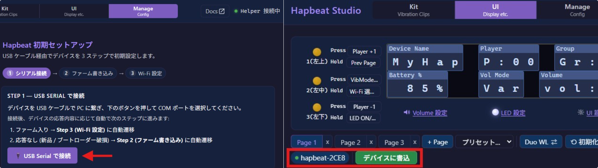
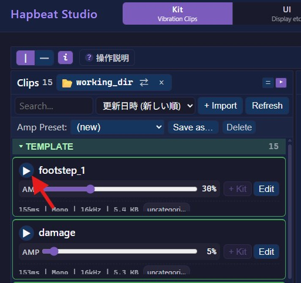

このページでは、**Studio + Wi-Fi UDP 経由で、無線版 Hapbeat (Duo WL / Band WL) から振動を出すまで** の流れを示します。

## Hapbeat SDK 構成

Hapbeat SDK には **設定・デザインフロー**（Studio + Helper）と、**ゲーム / アプリ実行フロー**（SDK 直結）の 2 系統があります。


### 設定・デザインフロー（このページ）

- **Hapbeat Studio**（ブラウザ + ローカルファイル）: 振動波形・ディスプレイ設定・Wi-Fi 設定・ファーム書込みを行う Web アプリ
- **hapbeat-helper**（CLI daemon）: `pipx install hapbeat-helper` で導入する PC daemon。Studio ↔ TCP / デバイス ↔ UDP / mDNS 自動検出を中継
- **Hapbeat**（Duo WL / Band WL）: ESP32 固定ランタイム。Kit ライブラリ・触覚出力・Wi-Fi SoftAP/STA・UDP 受信

### ゲーム / アプリ実行フロー

- **Unity SDK** 等の SDKによって、Quest / PC / スマートフォン等から Wi-Fi UDP broadcast で触覚イベントをHapbeat に Wi-Fi 経由で送信
- onClick / OnCollisionEnter などのイベントを触覚に紐づけるだけで動作
- ※Studio や Helper はアプリ実行時には **不要**

### 用意するもの

- **PC** (Windows / macOS)
- **Python 3.9 以上**（インストール済みか事前に確認してください）
  - 無い場合は公式よりDL→ https://www.python.org/downloads/
- **Chrome または Edge ブラウザ** (Web Serial / File System Access が必要)
- **USB-C ケーブル** (データ通信対応 — 充電専用ケーブル不可)
- **2.4 GHz Wi-Fi LAN**（Hapbeat は 2.4 GHz のみ対応）
- **Hapbeat** (Duo WL / Band WL)

---

## Step 1 — Helper をインストール

コマンドプロンプト / PowerShell（Windows）またはターミナル（macOS）を開き、以下を実行します。**実行するディレクトリはどこでも構いません。**

**Windows:**
```bash
py -m pip install --user pipx && py -m pipx ensurepath
pipx install hapbeat-helper
```

**macOS:**
```bash
brew install pipx && pipx ensurepath
pipx install hapbeat-helper
```


インストール後、以下のコマンドで Helper を起動します:

```bash
hapbeat-helper start
```

OS 別の詳細手順やトラブルシューティングは **[hapbeat-helper インストールガイド](/docs/helper/getting-started/)** を参照してください。

:::tip[自動起動（常駐）]
毎回コマンドを打たずに PC 起動時に Helper を自動起動させることもできます。
詳細は [hapbeat-helper ドキュメント](/docs/helper/getting-started/) を参照してください。
:::

---

## Step 2 — Studio を開く

ブラウザで [https://devtools.hapbeat.com/studio/](https://devtools.hapbeat.com/studio/) を開きます。

画面上部に **「Helper 接続中」** が緑で表示されることを確認してください。表示されない場合は Helper が起動していないか、ポート 7703 が塞がれています（[トラブルシューティング](/docs/helper/getting-started/#トラブルシューティング)）。

:::note[Chrome / Edge のみ対応]
Safari や Firefox では Web Serial / File System Access API が使えないため、デバイスへの書き込みができません。Chrome または Edge をお使いください。
:::

---

## Step 3 — Hapbeat の Wi-Fi 設定と UI 書込み

Hapbeat を PC と同じ Wi-Fi に接続し、ディスプレイ UI を書き込みます。

1. **USB-C ケーブルで PC と Hapbeat を接続します。**

2. **Studio の Manage タブを開き、画面の指示に従います。**
   Studio で [USB Serial で接続] を押下し、Hapbeat とシリアル接続します。指示に従って、Studio を開いている PC と同じ Wi-Fi ネットワークに Hapbeat を接続してください。

3. **UI タブを開き、デバイスを選択して「デバイスに書き込む」を押します。**
   これでディスプレイ UI が Hapbeat に書き込まれます。※シリアル接続では書き込むことはできません。



:::note
以後、基本的に USB ケーブルは不要になります。SDK 各種は Wi-Fi に接続されている状態での使用を前提としており、USB ケーブルは Wi-Fi 接続のために使用します。
:::

---

## Step 4 — ライブラリから振動を再生して動作確認

Studio から Wi-Fi UDP 経由で Hapbeat に振動が出ることを確認します。Kit の作成や Deploy はこの段階では不要です。

1. **ワーキングディレクトリを選択**（初回のみ）
   左側パネルの [Choose Folder] を押下し、PC内の任意のフォルダを指定します。後で Kit を作成・保存する場所になります。

2. **左パネルのライブラリからテンプレート波形を選択します。**
   組み込み済みのサンプル波形が一覧表示されます。

3. **再生して Hapbeat が振動することを確認します。**

**Hapbeat が振動すれば動作確認完了です。** このまま Unity SDK に進められます。



:::note
Studio が読み書きするのは、ここで指定したワーキングディレクトリ配下のファイルだけです。それ以外のファイル・ディレクトリは一切触りません（ブラウザの File System Access API により、許可していないパスは技術的にもアクセスできない仕組みです）。
:::

---

## 次のステップ — SDK からアプリに組み込む

ここまでで Hapbeat 単体での再生環境が整っています。次は SDK 経由でアプリケーション（ゲーム / VR / インスタレーション）から振動を発火させます。

- **[Unity SDK Getting Started](/docs/unity-sdk/getting-started/)**
- Unreal SDK / Creative Kit — [今後の実装予定](/docs/coming-soon/)

## 次に読むページ

- [アーキテクチャ全体像](/docs/concepts/architecture/) — Studio / Helper / SDK / Firmware の役割分担
- [通信モデル](/docs/concepts/communication-model/) — Wi-Fi UDP broadcast と ESP-NOW
- [gain の乗算構造](/docs/concepts/gain-architecture/) — Studio と SDK の責務分離
- [Contracts 仕様](/docs/contracts/overview/) — プロトコル詳細
- [FAQ / トラブルシューティング](/docs/faq/)
