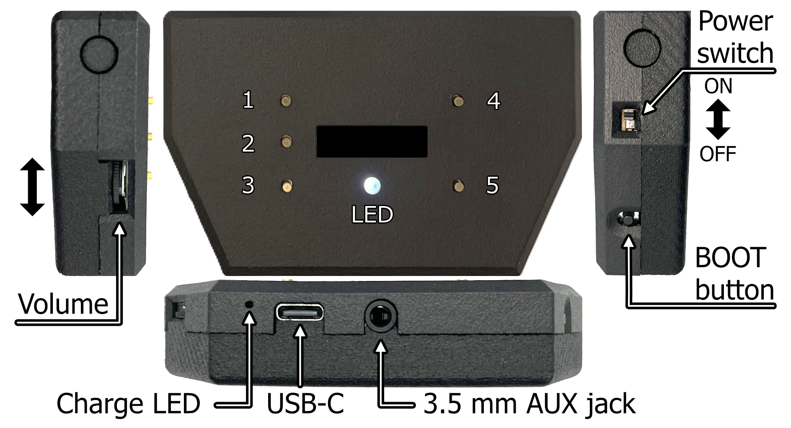
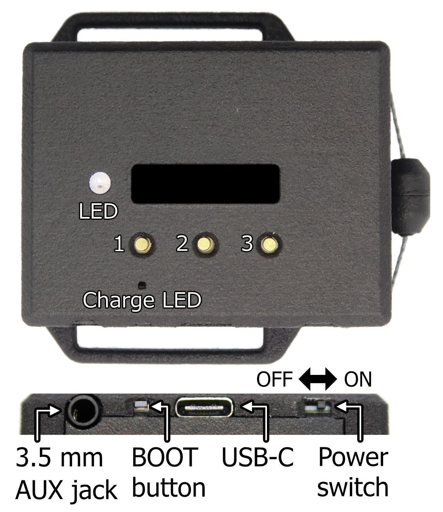

Hapbeat は装着して使う **ワイヤレス触覚デバイス** です。ESP32 を内蔵し、Wi-Fi UDP 経由でゲーム / アプリ / Studio から触覚イベントを受け取って振動します。本ページではハードウェア各モデルの特徴と、デバイス側で完結する操作（ボタン・OLED・SoftAP 切替）をまとめます。

> Wi-Fi 接続やファーム書き込みの初期設定は [Hapbeat を初期設定する](/docs/tools/studio/initial-setup/) を参照してください。

## 製品ラインナップ

| モデル | 装着部位 | チャネル数 | 主用途 |
|---|---|---|---|
| **Duo WL** | 首掛け | 2 ch (左右独立) | VR / ゲームの空間触覚・全身に響かせたい場面 |
| **Band WL** | リスト / アンクル | 1 ch | スマホ・アプリ・控えめなフィードバック向け |

## Duo WL

### 特徴

- **首掛けの 2 チャネル独立駆動** で、左右に分離した触覚を伝えられる
- **Wi-Fi UDP 受信** で PC / Quest / スマートフォンと**直接通信** (中継サーバ・PC ペアリング不要)
- **OLED ディスプレイ** + **物理ボタン** でデバイス側から Wi-Fi 切替・Player / Group 番号変更が可能
- **USB-C 充電** + **バッテリー残量自動報告**
- ファームウェアは出荷時に書き込み済み。**ユーザーがソースコードを書く必要は無い**

### 装着のコツ

- ネックバンド部を **首の付け根** に乗せ、振動素子が **鎖骨の上** に当たる位置に調整する
- 振動が伝わりにくい場合は装着位置を微調整する
- 服の上から装着しても構わないが、**薄手の生地** の方が振動が伝わりやすい

## Band WL

<!-- TODO: device-band-wl-feature.png 追加後に画像とテキストを差し替える -->

リスト / アンクル装着の単チャネル版。スマートフォン / 軽量アプリと組み合わせて使う想定。

## ボタン操作

Hapbeat は本体ボタンだけで Wi-Fi 切替やプレイヤー / カテゴリ変更ができます。割当は Studio の「設定」タブから変更可能ですが、出荷時のデフォルトは以下のとおりです。

### Duo WL (Necklace, 5 ボタン)

| 位置 | Studio ID | デフォルト機能 |
|---|---|---|
| 左上 | btn_1 | Category UP |
| 左中 | btn_2 | Mode Toggle (Volume ↔ Fix) |
| 左下 | btn_3 | Category DOWN |
| 右上 | btn_4 | Channel UP (Player) |
| 右下 | btn_5 | Channel DOWN (Player) |

Volume 調整は本体側面の **アナログボリュームノブ** で行います。

### Band WL (3 ボタン)

| 位置 | Studio ID | Volume モード | Fix モード |
|---|---|---|---|
| 左 | btn_l | Volume UP | Category NEXT |
| 中央 | btn_c | Mode Toggle | Mode Toggle |
| 右 | btn_r | Volume DOWN | Channel NEXT |

Band は中央ボタンで **Volume モード / Fix モード** を切り替え、左右ボタンの役割が入れ替わります。現在のモードは OLED に表示されます。

> 各ボタンには **短押し / 長押し / Hold** で別動作を割り当てできます。詳細とカスタマイズは Studio の Manage → 設定 タブから。

## OLED / LED 表示

### LED

| 表示 | 状態 |
|---|---|
| LED 赤点灯 | 充電中 |
| LED 緑点灯 | 充電完了 |
| LED 消灯（電源 ON 時） | 通常動作中 |

### OLED 主要要素

| 表示 | 意味 |
|---|---|
| `Cat_N` | 現在の Category（カテゴリ）番号 |
| `CH_N` | 現在の Channel（Player）番号 |
| `Gr:NN` | Group ID（マルチプレイヤー LAN で使用） |
| `vNN` | 現在の Volume レベル（0〜99） |
| アプリ名 | 接続中のアプリ名 (Unity SDK 等が送信) |
| `BAT` + バーメーター | バッテリー残量（5 段階） |

OLED のレイアウトと送信側 address の対応は [Address の仕組み](/docs/concepts/group-player-addressing/) に詳細があります。

## SoftAP モードの切替

ルーターが使えない環境（VR HMD と直接接続するなど）で、Hapbeat 本体を Wi-Fi アクセスポイント (SoftAP) に切り替えるには、本体ボタンで操作できます。

| モデル | コンボ | 動作 |
|---|---|---|
| **Duo WL** | 左中ボタン (`btn_2`) + 右下ボタン (`btn_5`) を **3 秒長押し** | STA ↔ AP モードを切り替えて再起動 |
| **Band WL** | 中央ボタン (`btn_c`) + 右ボタン (`btn_r`) を **3 秒長押し** | STA ↔ AP モードを切り替えて再起動 |

長押し中は OLED に `AP in 3...` / `STA in 3...` のカウントダウンが表示されます。途中で離せばキャンセル可能です。

- **AP モードに入ると**: SSID `Hapbeat-XXXXXX` (XXXXXX は MAC 末尾) でアクセスポイントを起動。HMD / PC からこの SSID に接続して使用します。AP パスワードは Studio または `ap set` シリアルコマンドで設定（未設定時は開放 AP）
- **STA モードに戻すと**: 登録済み Wi-Fi プロファイルに自動で再接続
- **クライアントが 10 分間接続されない** と AP モードはタイムアウトして自動的に STA に戻ります

## Wi-Fi 設定

初期 Wi-Fi 設定と SSID の追加は **Studio のオンボーディングウィザード** で行います。USB Serial 接続が必要です。

➡️ [Hapbeat を初期設定する](/docs/tools/studio/initial-setup/)

## 関連リンク

- [Hapbeat を初期設定する](/docs/tools/studio/initial-setup/) — 入手後の Wi-Fi 設定とファーム書き込み手順
- [仕様と認証](./specifications/) — MCU / 通信 / バッテリー / 技適番号
- [運用ガイド](./care/) — 充電・お手入れ・取扱注意
- [トラブルを解決する](./troubleshooting/) — 起動しない / 振動が出ない時 / 既知問題
- [アーキテクチャ全体像](/docs/concepts/architecture/) — Hapbeat と Studio / SDK の関係
