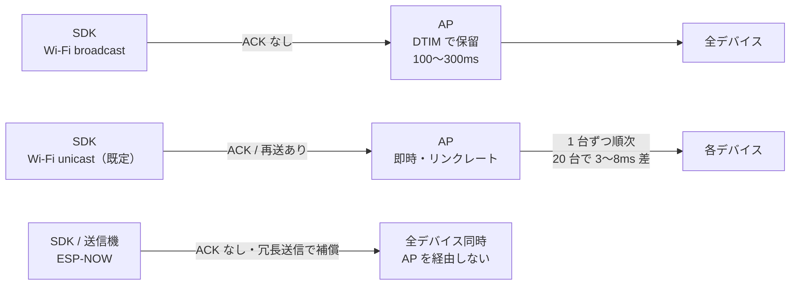

Hapbeat の触覚イベントはネットワーク経由でデバイスに届きます。このページでは **標準経路（Wi-Fi UDP unicast）** と **上位オプション（ESP-NOW）** の設計判断を説明します。

## 標準: Wi-Fi UDP unicast

```
SDK / アプリ
  ↓ UDP unicast (既知デバイスへ 1 台ずつ)
Hapbeat デバイス（受信したパケットの target を見て自己受信判定）
```

SDK は触覚イベントを、発見済みデバイスの IP へ **unicast** で送ります。各デバイスは受信したパケットに含まれる **target（group / player）** を見て、自分宛てかどうかを判定して再生 / 無視します。

### なぜ broadcast ではなく unicast か

Wi-Fi の broadcast（group-addressed フレーム）には、送信側では回避できない遅延要因があります。

- **DTIM バッファリング** — 同じアクセスポイントに省電力状態の端末が **1 台でもいると**、AP は group-addressed フレームを次の DTIM ビーコンまで保留します。周期は **100〜300ms 級**で、**送信側からは制御できません**。Hapbeat 本体は省電力を無効化していますが、保留を起こすのは周囲の無関係な端末（スマホ等）なので、本体側の設定では防げません。
- **ACK / 再送が無い** — broadcast は MAC 層の ACK と再送がなく、さらに最低基本レートで送られるため、loss しやすく電波占有時間も長くなります。
- **unicast は速い** — MAC 層の ACK + 再送があり、リンクレート（高速）で飛びます。**10 台程度までは、電波の占有時間の合計も broadcast より短くなります。**

したがって「専用 AP なら broadcast で十分」ではなく、**どの環境でも unicast が最良**です。環境に応じて切り替える必要はありません。

### unicast の弱点と、SDK 側の担保

unicast は送信側が宛先 IP を知っている必要があります。SDK は次のように補います。

- **既知デバイスが 0 台のときは broadcast にフォールバック**します。まだ 1 台も発見できていない状態でも触覚は届きます。
- デバイスは Wi-Fi 接続直後に自分から PONG を名乗るため、電源を入れ直した機体も短時間で既知になります（※ この挙動は firmware 側の対応が入ってからのものです。現時点では SDK の定期 PING によって発見されます）。
- **ユーザーから見た使い方は変わりません。** 従来どおり target を指定して送り、デバイス側が取捨選択します。SDK が配送手段を変えただけで、EventMap も API も変更ありません。

### 台数と同時性

unicast は台数分を順に送るため、先頭の機体と最後の機体に時間差が出ます。1 パケットあたりの電波占有はおよそ **150〜300µs**（混雑時は 500µs 級）です。

以下は **802.11 の機構から導いた計算値であり、実測値ではありません**。目安として扱ってください。

| 台数 | 先頭と末尾の差（目安・計算値） |
|---|---|
| 2 台 | 0.2〜0.5ms |
| 5 台 | 0.8〜2ms |
| 10 台 | 1.5〜4ms |
| 20 台 | 3〜8ms |
| 50 台 | 8〜20ms |
| 100 台 | 15〜40ms |

触覚の同時性は概ね **10〜20ms 以内なら知覚されにくい**とされます。**20 台までは実用上問題なく**、50 台で条件次第、100 台では差を感じ得る領域に入ります。

厳密な同時性が要る場合は **`target_time`（予約再生）** を使います。少し先の時刻を指定して全台に送れば、到着順に関係なく同時に鳴ります（デバイス側は実装済み）。ただし送信側とデバイスの時計合わせが必要なため、**大規模な同時駆動を行う場合は個別に検討が必要**です。詳細は後述の [low-latency の鍵: targetTime](#low-latency-の鍵-targettime) を参照してください。

### 3 経路の比較



### なぜアプリ層で ACK しないか

Hapbeat は UDP をそのまま使い、アプリ層の ACK / 再送を持ちません（unicast では MAC 層の ACK / 再送が効きます）。これは意図的な選択です:

> **触覚は「遅れて届くより消えた方がマシ」**

ゲーム中の効果音は、ネットワーク遅延で 200ms 後に届くより、その回のフレームだけ脱落するほうが体験を壊しません。アプリ層の ACK / 再送を入れると遅延変動が大きくなるため、Hapbeat は固定遅延を優先します。

### 制約

- **同一サブネット必須** — デバイス発見（mDNS）と broadcast フォールバックはルーターを越えません
- **2.4 GHz Wi-Fi のみ対応**（ESP32 の制約）
- **VR HMD は AP 機能を持たない** ため、ルーターなし環境では **Hapbeat 自身が SoftAP** になる構成を取ります（後述）

## 接続シナリオ

| シナリオ | 構成 | 用途 |
|---|---|---|
| **A. 単独プレイヤー LAN**（推奨） | 通常ルーター経由、Group 指定なし | 自宅 / オフィス |
| **B. マルチプレイヤー LAN** | ルーター経由、プレイヤー毎に固有 group/player ID | 同一 LAN で複数人プレイ |
| **C. モバイルホットスポット** | スマホ / PC テザリング（2.4 GHz 固定） | 移動先・出張 |
| **D. Hapbeat SoftAP** | Hapbeat 1 台が AP、HMD + 他 Hapbeat が STA | ルーターなし環境（Quest 等） |
| **E. 展示ブース隔離** | ブースごとに独立 AP、B と同等 | イベント・展示会 |

詳細: [](/docs/tools/studio/initial-setup/) / [](/docs/hardware/overview/#softap-モードの切替)

## 上位オプション: ESP-NOW 経路

Wi-Fi unicast では捌けない規模（数十台同時）や、Wi-Fi が使えない環境では **ESP-NOW** 経由のオプション経路があります。

```
SDK / アプリ
  ↓ UDP / OSC
hapbeat-bridge (PC / ホスト)
  ↓ シリアル
hapbeat-transmitter-firmware (ESP32 送信機)
  ↓ ESP-NOW (2.4 GHz radio, AP 不要)
Hapbeat デバイス（複数台一斉）
```

- **送信機（Transmitter）** が ESP-NOW で複数 Hapbeat に同報
- **Bridge** がホスト側の制御面（UDP/OSC 受信、device registry、time sync）
- ルーターも AP も不要、ESP-NOW の生帯域だけ使う

ESP-NOW が台数に強いのは「broadcast だから」ではありません。**AP を経由しないため DTIM バッファリングが存在せず、1 回の送信で全台に同時に届く**（台数に依存しない）という構造によるものです。代わりに ACK / 再送が無いので、**時間的に分散させた冗長送信で loss を補う**設計になっています。

通常の用途では Wi-Fi unicast で十分なので、ESP-NOW 経路は「大規模パフォーマンス」「Wi-Fi 不在環境」「Hapbeat 専用ネットワークを組みたい」場合のみ採用します。

## なぜ Bluetooth を主経路にしないか

過去の v1 では Bluetooth 経路を使っていましたが、以下の理由で Wi-Fi UDP に移行しました:

- **ペアリング管理が煩雑** — 複数台 / 複数プラットフォームで体験が劣化
- **ブロードキャストが不得意** — BLE Advertise は帯域・パケット数で UDP に劣る
- **PC / Quest / スマホで API が分断** — 各 OS で BLE 実装が違いすぎる
- **同時接続数の制約** — Central 側のリンク数上限

現行 BT 版（hapbeat-bt-firmware）は v1 互換維持のため残っていますが、新規ユーザーは Wi-Fi 版（Duo WL / Band WL）が前提です。

## low-latency の鍵: targetTime

Hapbeat は遅延を吸収するために **targetTime（将来の発火時刻）** を指定できます。SDK は「今すぐ」ではなく「100ms 後に発火」と送り、デバイスは時刻同期した自分の時計でその時点に再生します。

これにより、ネットワーク揺らぎがあっても発火タイミングは安定します。詳細は [](/docs/concepts/contracts/overview/) を参照。

## 経路の選び方

| 規模・要件 | 推奨 |
|---|---|
| 〜20 台（大半のプロジェクト） | **unicast**（既定のまま。設定不要） |
| 厳密な同時発火が要る | unicast + `target_time` |
| 数十台以上 | ESP-NOW |

## 関連

- [アーキテクチャ全体像](./architecture/)
- [Address の仕組み](./group-player-addressing/)（予定）
- [](/docs/tools/studio/initial-setup/)
