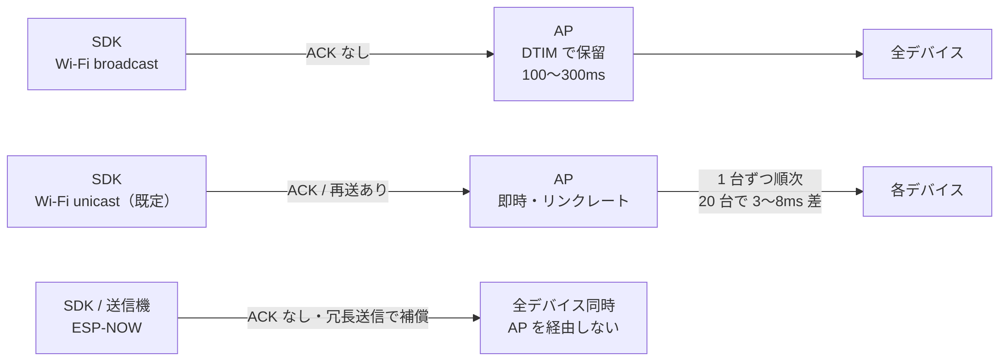

Hapbeat の触覚イベントは **Wi-Fi の UDP unicast** でデバイスに届きます。SDK が発見済みデバイスの IP へ 1 台ずつ送り、各デバイスはパケット内の **target（player / group）** を見て自分宛てかを判定します。

**この経路は既定で有効で、設定は不要です。** 環境に応じて切り替える必要もありません。

## 経路の選び方

| 規模・要件 | 使うもの |
|---|---|
| 〜20 台（大半のプロジェクト） | **Wi-Fi unicast**（既定・設定不要） |
| 厳密な同時発火が要る | Wi-Fi unicast + `target_time` |
| 数十台以上、または Wi-Fi が使えない | ESP-NOW（[後述](#上位オプション-esp-now)） |

## 台数と同時性

unicast は台数分を順に送るため、先頭の機体と最後の機体に時間差が出ます。

| 台数 | 先頭と末尾の差 |
|---|---|
| 2 台 | 0.2〜0.5ms |
| 5 台 | 0.8〜2ms |
| 10 台 | 1.5〜4ms |
| 20 台 | 3〜8ms |
| 50 台 | 8〜20ms |
| 100 台 | 15〜40ms |

触覚の同時性は概ね **10〜20ms 以内なら知覚されにくい**とされます。**20 台までは実用上問題なく**、50 台で条件次第、100 台では差を感じ得る領域に入ります。

:::note
上表は 802.11 の機構から導いた**計算値であり実測値ではありません**（1 パケットあたりの電波占有 150〜300µs、混雑時 500µs 級を前提）。目安として扱ってください。
:::

### 厳密な同時性が要る場合

**`target_time`（予約再生）** を使います。少し先の時刻を指定して全台に送れば、到着順に関係なく同時に鳴ります。SDK は「今すぐ」ではなく「100ms 後に発火」と送り、デバイスは時刻同期した自分の時計でその時点に再生するため、ネットワークの揺らぎがあっても発火タイミングが安定します。

ただし送信側とデバイスの時計合わせが必要なため、**大規模な同時駆動では個別に検討が必要**です。

## 制約

- **同一サブネット必須** — デバイス発見（mDNS）はルーターを越えません
- **2.4 GHz Wi-Fi のみ**（ESP32 の制約）
- **VR HMD は AP 機能を持たない** — ルーターなし環境では Hapbeat 自身が SoftAP になります
- **発見前のデバイスには unicast できない** — 既知デバイスが 0 台のときは broadcast にフォールバックするため、起動直後でも触覚は届きます

## 接続シナリオ

| シナリオ | 構成 | 用途 |
|---|---|---|
| **A. 単独プレイヤー LAN**（推奨） | 通常ルーター経由 | 自宅 / オフィス |
| **B. マルチプレイヤー LAN** | ルーター経由、プレイヤー毎に固有 player / group | 同一 LAN で複数人プレイ |
| **C. モバイルホットスポット** | スマホ / PC テザリング（2.4 GHz 固定） | 移動先・出張 |
| **D. Hapbeat SoftAP** | Hapbeat 1 台が AP、HMD + 他 Hapbeat が STA | ルーターなし環境（Quest 等） |
| **E. 展示ブース隔離** | ブースごとに独立 AP、B と同等 | イベント・展示会 |

詳細: [](/docs/tools/studio/initial-setup/) / [](/docs/hardware/overview/#softap-モードの切替)

## 上位オプション: ESP-NOW

数十台同時、または Wi-Fi が使えない環境では **ESP-NOW** 経路を使います。

```
SDK / アプリ
  ↓ UDP / OSC
hapbeat-bridge (PC / ホスト)
  ↓ シリアル
hapbeat-transmitter-firmware (ESP32 送信機)
  ↓ ESP-NOW (2.4 GHz radio, AP 不要)
Hapbeat デバイス（複数台一斉）
```

**AP を経由しないため 1 回の送信で全台に同時に届き、台数に依存しません。** 代わりに ACK / 再送が無いので、時間的に分散させた冗長送信で loss を補う設計です。ルーターも AP も不要です。

通常の用途では Wi-Fi unicast で十分なので、ESP-NOW は「大規模パフォーマンス」「Wi-Fi 不在環境」「Hapbeat 専用ネットワークを組みたい」場合に採用します。

---

## 設計背景

以下は仕組みを知りたい方向けの補足です。通常の導入では読む必要はありません。

### なぜ broadcast ではなく unicast か

Wi-Fi の broadcast（group-addressed フレーム）には、送信側では回避できない遅延要因があります。

- **DTIM バッファリング** — 同じ AP に省電力状態の端末が **1 台でもいると**、AP は group-addressed フレームを次の DTIM ビーコンまで保留します。周期は **100〜300ms 級**で、送信側からは制御できません。Hapbeat 本体は省電力を無効化していますが、保留を起こすのは周囲の無関係な端末（スマホ等）なので本体側の設定では防げません
- **ACK / 再送が無い** — broadcast は最低基本レートで送られ、loss しやすく電波占有時間も長くなります
- **unicast は速い** — MAC 層の ACK + 再送があり、リンクレートで飛びます。10 台程度までは電波占有時間の合計も broadcast より短くなります

したがって「専用 AP なら broadcast で十分」ではなく、**どの環境でも unicast が最良**です。



### なぜアプリ層で ACK しないか

> **触覚は「遅れて届くより消えた方がマシ」**

ゲーム中の効果音は、200ms 後に届くより、その回だけ脱落するほうが体験を壊しません。アプリ層の ACK / 再送は遅延変動を大きくするため、Hapbeat は固定遅延を優先します（unicast では MAC 層の ACK / 再送が効きます）。

### なぜ Bluetooth を主経路にしないか

v1 では Bluetooth を使っていましたが、ペアリング管理の煩雑さ、ブロードキャストの不得手さ、PC / Quest / スマホでの API 分断、同時接続数の制約から Wi-Fi UDP に移行しました。現行 BT 版は v1 互換維持のために残っていますが、新規ユーザーは Wi-Fi 版（Duo WL / Band WL）が前提です。

## 関連

- [](/docs/concepts/architecture/)
- [](/docs/concepts/group-player-addressing/)
- [](/docs/tools/studio/initial-setup/)
