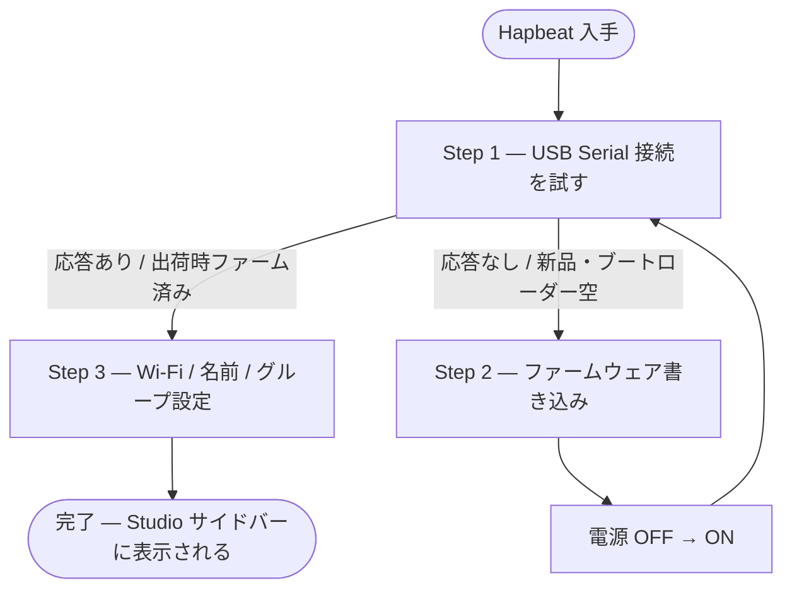

Hapbeat を初めて使えるようにするまでの作業です。**Studio の Devices タブ右側に表示されるオンボーディング ウィザード** がこの流れに沿って案内します。一度 Wi-Fi に乗ってしまえば、以降は USB ケーブルを繋ぐ必要はありません。

> 💡 USB ケーブルでファームウェアを書き込み、Wi-Fi 設定を一回行うだけです。次回以降は電源を入れれば LAN/Wi-Fi で自動的に Studio に表示されます。

## 用意するもの

- **Hapbeat デバイス** (Necklace / Band)
- **USB ケーブル** (デバイスとデータ通信できる USB-C ケーブル — 充電専用ケーブルは NG)
- **PC** (Windows / macOS / Linux、Chrome または Edge ブラウザ)
- **Wi-Fi ネットワーク** (2.4 GHz が前提。SSID とパスワード)
- **`hapbeat-helper`** がインストールされ起動済みであること (`pipx install hapbeat-helper`)

## ワークフロー全体図

## Step 0: Studio を開いて Helper を起動

1. ブラウザで Studio を開く: <https://devtools.hapbeat.com/studio/>
2. `hapbeat-helper` が起動していることを確認。初回は `hapbeat-helper install-service` で自動起動を登録（推奨）、または `hapbeat-helper start` で手動起動。Studio 上部に **「Helper 接続中」** と緑色で表示されれば OK。
   - 緑バッジは clickable で、クリックすると Helper Manage モーダル (version 確認・起動コマンドの表示) が開きます
   - 赤の **「Helper 未接続」** の場合はクリックでインストール手順モーダルが開きます
3. **Manage タブ** をクリック。サイドバーにデバイスが何も無い状態だと右側にウィザードが表示されます。

## Step 1: USB Serial で接続する

接続は **左サイドバーの「USB Serial」欄** から行います（ウィザード側に接続ボタンはありません）。

1. Hapbeat と PC を **USB ケーブル** で繋ぎます。
2. 左サイドバー「USB Serial」欄の **＋ ボタン** を押し、COM ポート選択ダイアログで Hapbeat のポートを選びます。
   - 一度許可した COM ポートは以降そのまま再利用されます。
   - 複数の Hapbeat はそれぞれ別のカードとして並びます（`#1` `#2` …）。
3. 追加された **カードのチェックを ✔** にすると接続します。

### 結果に応じて 2 通りに自動分岐

接続すると、デバイスの応答に応じてウィザードが自動で次のステップへ進みます。

- ✅ **ファーム入り** → **Step 3（Wi-Fi 設定）** に自動遷移します。
- ⚠️ **応答なし**（新品 / ブートローダー空）→ **Step 2（ファーム書き込み）** に自動遷移します。

## Step 2: ファームウェア書き込み (応答が無かった場合のみ)

> 出荷時にファームウェアが書き込まれている個体は **このステップ不要** です。Step 1 の応答チェックでスキップされます。

1. ウィザードの「ノードの種類」で **Hapbeat** を選び、お手持ちのバリアント（Necklace / Band）を選択します。
2. **「Serial 書き込み」** ボタンを押します。
3. ブラウザの COM ポート選択ダイアログでデバイスを選択。
4. 進捗バーが完了するまで待ちます (約 30 秒〜1 分)。
   - 「圧縮を使う」のチェックは **OFF のまま** が安定です (921600 baud + 圧縮では稀に `status 201` で失敗する既知問題があります)。
5. **書き込み完了**: Hapbeat の電源を OFF → ON してください。その後、左の **USB Serial カードのチェックを入れ直して**再接続します。
   - 接続成功 → Step 3 に自動遷移すれば成功です。

### Step 2 でうまくいかない時

- `status 201` (`ESP_TOO_MUCH_DATA`) で止まる: 別の USB ポート / ケーブル / ハブを試してください。
- 「Web Serial API がサポートされていません」: Chrome / Edge を使ってください (Firefox / Safari は非対応)。
- 何度書いても Step 1 で応答しない: デバイスのリセットボタン (押下 5 秒以上) を試してから再度 Step 1 を実行してください。

## Step 3: Wi-Fi / 名前 / グループ設定

ウィザードが Wi-Fi 設定パネルを開きます。

1. **デバイス識別**: 任意で名前を変更します (例: `hapbeat-living`)。デフォルト名のままでも構いません。
2. **Wi-Fi 設定 → ＋ 新規追加** を押し、SSID とパスワードを入力して **「追加」**。
3. プロファイル一覧でその SSID の **「接続」** ボタンを押します。
4. デバイスが Wi-Fi に繋がると、上部の status が **「接続中 · SSID=…」** に変わります。
5. 数秒で **左サイドバーにデバイスが自動的に出現** します — これで初期セットアップ完了です 🎉

> 💡 Wi-Fi 接続が確認できたら **USB ケーブルは外して構いません**。以降は電源を入れれば自動的に Wi-Fi に再接続して Studio から見えます。

## 完了後

- Devices タブ左サイドバーで対象 Hapbeat を選択して、**Kit のインストール**・**ファームのアップデート (OTA)**・**LED や音量の設定**・**Wi-Fi プロファイルの追加削除** などが行えます。
- 出張先など別 Wi-Fi に持っていく場合: Studio の Devices → 設定 → Wi-Fi で別の SSID を追加するだけ (5 つまで保存できます)。
- **センサー → ブローカー → Hapbeat の MQTT アラート構成**を組みたい場合は、[MQTT アラートを初期設定する](/docs/tools/studio/mqtt-alerts/) に進んでください。

## 困ったときに

| 症状 | 対処 |
|---|---|
| Helper 接続中 と表示されない | `pipx install hapbeat-helper` 実行 → ターミナルで `hapbeat-helper` を起動 |
| Step 1 で COM ポートが出てこない | USB ケーブルが充電専用ではなくデータ通信対応か確認 / 別の USB ポートを試す |
| `status 201` で書き込み失敗 | 別の USB ポート / 別の USB ケーブル / 別の USB ハブを試す |
| Wi-Fi が繋がらない (`ssid not found`) | 5 GHz 専用 SSID は不可、2.4 GHz 対応の SSID を選択 |
| サイドバーに出てこない | 数十秒待つ / Helper を再起動 / Hapbeat の電源を一度切って入れ直す |

実装ノート: ウィザード本体は `src/components/devices/OnboardingWizard.tsx`。Studio 内のシリアル接続は **すべて** 単一マスターストア `src/stores/serialMaster.ts` 経由で行います (Web Serial API は port を 1 owner しか持てないため Studio 全体で 1 master)。下層の Serial 通信レイヤーは `src/utils/serialConfig.ts` (line-based JSON プロトコル) と `src/utils/serialFlasher.ts` (esptool-js ラッパ) を参照。
