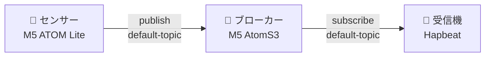

センサーが色（状態）を検知したら、MQTT 経由で Hapbeat（装着デバイス）を鳴動させ、**ボタンで止めるまでループ**させる — 病院・施設などの「必ず気付かせたい」用途向けの構成を、最短手順で組みます。

このページは **Hapbeat SDK を初めて触る方** を想定しています。エンジニアでない方も対象です。プログラミングは不要で、作業は **PC のターミナル（Windows なら PowerShell / macOS ならターミナル）** での Helper インストール 1 回 と、その後はブラウザ + USB ケーブル接続だけで完了します。

## 構成

3 つのノードを順に立ち上げて繋ぎます。

| ノード | ハードウェア | Studio 上の種別タグ | 役割 |
|---|---|---|---|
| 🎨 センサー | M5 ATOM Lite + 色センサー | `SENDER` | 色を検知して MQTT publish |
| 📡 ブローカー | M5 AtomS3 | `BROKER` | MQTT サーバー本体（3 ノード間の中継）・mDNS で自分を広告 |
| 📳 受信機 | Hapbeat (Band / Necklace) | `RECEIVER` | 振動を出す・OLED にアラート文字を表示・ボタンで停止 |

## 用意するもの

- **Hapbeat 受信機** (Band / Necklace) 1 台以上
- **ブローカー機** (M5 AtomS3) 1 台
- **センサー機** (M5 ATOM Lite + 色センサー) 1 台
- **PC** (Windows / macOS、Chrome または Edge)
- **USB-C ケーブル** (データ通信対応 — 充電専用ケーブル不可)
- **2.4 GHz Wi-Fi LAN** — **設定用 PC を含む 4 者** (3 ノード + PC) すべてが同じ LAN に接続されている前提

:::note[出荷状態]
すべての機器は **ファーム書き込み済みで出荷** されています。動作確認まで USB Serial 経由でのファーム書き込みは不要です（[ファームウェアを再書き込み](#ファームウェアを再書き込み) 参照）。
:::

## 全体の流れ

このページを上から順に進めれば、まっさらな環境から一直線で動作確認まで辿り着きます。

1. **[Step A](#step-a-hapbeat-受信機を-wi-fi-に接続)** — Hapbeat 受信機を Wi-Fi に接続（別ページ：Getting Started Step 1〜4）
2. **[Step B](#step-b-hapbeat-受信機を-mqtt-用に仕上げる)** — Hapbeat の表示を MQTT 用に差し替え + Kit をデプロイ
3. **[Step C](#step-c-ブローカー機を準備する)** — ブローカー機を Wi-Fi に接続
4. **[Step D](#step-d-センサー機を準備する)** — センサー機を Wi-Fi に乗せ、色 → イベントのマッピング
5. **[Step E](#step-e-動作確認)** — 3 ノード接続確認 → 色をかざして振動確認

---

## Step A: Hapbeat 受信機を Wi-Fi に接続

まずは Hapbeat 単体で振動が出ることを確認します。この部分は **共通のセットアップガイド** に従ってください。

➡ **<a href="/docs/start-here/getting-started/" target="_blank" rel="noopener noreferrer">Getting Started</a> の Step 1 〜 Step 4 まで進めてください**（新しいタブで開きます。終わったらこのタブに戻って Step B へ）。

そこでは以下を行います。

1. **Step 1** — PC に `hapbeat-helper` をインストール（`pipx install hapbeat-helper`）
2. **Step 2** — ブラウザで Hapbeat Studio を開く（[https://devtools.hapbeat.com/studio/](https://devtools.hapbeat.com/studio/)）
3. **Step 3** — Hapbeat を USB 接続して Wi-Fi に接続（Studio 画面の指示に従って進めます）
4. **Step 4** — ライブラリ波形を再生して、Hapbeat が振動することを確認

:::tip[完了の目印]
Hapbeat 本体が振動すれば OK。Studio の左サイドバーに Hapbeat が **online** で並んでいる状態で、このページに戻ってきてください。

戻ってきたら **[Step B](#step-b-hapbeat-受信機を-mqtt-用に仕上げる)** に進みます。USB ケーブルは外して構いません（以降は Wi-Fi 経由で操作します）。
:::

---

## Step B: Hapbeat 受信機を MQTT 用に仕上げる

Getting Started で振動が出る状態になったので、次にこの Hapbeat に **アラート専用の見た目（OLED 表示）と Kit（振動波形）** を入れます。

### B-1. OLED 表示を MQTT アラート用レイアウトに差し替え

Getting Started で書き込んだ既定の表示には MQTT 接続状態の表示が含まれていません。MQTT アラート用のサンプル JSON で差し替えます。

1. <a href="/samples/mqtt-alert/ui-config-band-v2.json" download><code>ui-config-band-v2.json</code></a> をクリックしてダウンロード（Band WL 用。Necklace の方は [サンプル設定ファイル](#サンプル設定ファイル) を参照）
2. Studio の **UI タブ** を開く（画面上部の `UI / Display etc.` タブ）
3. ツールバー右上の **読込** ボタンを押して、先ほどダウンロードした JSON を選択
4. プレビュー右下に **「レイアウトを読み込みました」** と出れば取り込み完了
5. 画面下の緑の **デプロイ** ボタン左隣で、書き込み対象が **対象 Hapbeat** になっていることを確認
6. **デプロイ** ボタンをクリック
7. Hapbeat の OLED に **`MQTT [NG]`** という表示が出る（まだブローカー未接続なので NG。後で `[OK]` に変わります）

このサンプルでは、Hapbeat 本体のボタンに次の挙動を割り当てています:

- **左ボタン**: 押している間だけ別ページに表示切替（離すと元に戻る）
- **中央ボタン**: 未割当
- **右ボタン**: 短押し = 受信制限モード ⇄ 全色受信を切替 / 長押し = LED ON/OFF
- **アラート鳴動中**: 任意のボタンを **一度離してから約 1 秒長押し** で停止 (ack)

### B-2. アラート用 Kit を作って Hapbeat にデプロイ

Hapbeat が再生する振動波形は、**Kit** という単位でデバイス内に保存しておきます。ここでは小さい Kit を 1 つ作って入れます。

1. **Kit タブ** を開く（画面上部の `Kit / Vibration Clips`）
2. 右ペイン（Kit パネル）上部の入力欄に Kit 名を入力（例: `alert-kit`）→ **Create** ボタン
3. 左ペイン（Library パネル）から振動素材を 1〜2 個選び、各クリップの **+ Kit** ボタンで Kit に追加
   - 例: 強めの素材を `urgent`、弱めを `calm` として 2 つ追加
4. 必要に応じて Amp スライダーで強度（0〜100%）を調整
5. Kit パネル下部の **Deploy** ボタンをクリック → Helper 経由で Hapbeat に書き込み

:::note[Save Folder と Deploy]
Deploy は「ローカル保存 + デバイス送信」を同時に行います。手元のフォルダにだけ書き出したいときは **Save Folder** ボタンを使います。詳細は <a href="/docs/tools/studio/kit-design/" target="_blank" rel="noopener noreferrer">Kit を作って配布する</a> を参照。
:::

### B-3. Kit が入ったか確認し、Event ID をメモする

Hapbeat から振動が出ることと、発火に使う Event ID を確認します。

1. **Manage タブ** を開く（画面上部の `Manage / Config`）
2. 左サイドバーで対象 Hapbeat を選択
3. 右ペインの **Kit サブタブ** をクリック
4. 上部の **⟳ 一覧取得** ボタンを押す
5. 数秒後に Kit カードが表示される（Step B-2 で Deploy した `alert-kit` が見えるはず）
6. カード内の Event 行をクリック → **Hapbeat が振動** すれば OK
7. 各 Event 行の **Event ID（例: `alert-kit.urgent`）をメモする** か、行の **📋 (コピー) ボタン** でクリップボードにコピー

:::tip[Event ID は Step D でセンサーに貼り付ける]
このメモした Event ID は、後の **Step D-2（色 → イベントのマッピング）** でセンサー側に貼り付けます。形式は `<kit-name>.<clip-name>` です。例: `alert-kit.urgent` / `alert-kit.calm`。
:::

ここまで来れば、Hapbeat 単体の準備は完了です。

---

## Step C: ブローカー機を準備する

ブローカー機（M5 AtomS3）は MQTT サーバーです。**Wi-Fi 設定だけ** で動作します。

1. ブローカー機（AtomS3）と PC を USB 接続
2. Studio の **Manage タブ** に切り替え
3. 左サイドバーの **USB Serial** 欄 → **＋** ボタンで AtomS3 を追加
   - ブラウザの COM ポート選択ダイアログから AtomS3 のポートを選択
4. 接続後に表示される設定画面で **ノードの種類** に **周辺機器** → **ブローカー** を選ぶ
   - 出荷時にファームが入っているので、書き込みは不要。**Wi-Fi 設定**ステップに自動で進みます
5. **Wi-Fi 設定** で SSID とパスワードを入力 → 接続
6. AtomS3 の LCD に稼働状態が表示される（接続クライアント数・最後の publish）

:::note[ブローカー側で MQTT の特別な設定は不要]
ブローカーは Wi-Fi に接続されると自動的に MQTT サーバーとして起動し、mDNS（`_mqtt._tcp`）で自分を広告し始めます。ホスト名やポートの調整が必要な場合は [ブローカーのホスト / ポート調整](#ブローカーのホスト--ポート調整) を参照。
:::

※PC のポートを空けたい場合は、PC との USB 接続を解除して別の USB アダプタや電源タップに差し替えても構いません。

---

## Step D: センサー機を準備する

### D-1. センサー機を Wi-Fi に接続

1. センサー機（ATOM Lite）と PC を USB 接続
2. Studio の **Manage タブ** → 左サイドバー **USB Serial** 欄 → **＋** で追加
3. 接続後に表示される設定画面で **ノードの種類** に **周辺機器** → **センサ送信機** を選ぶ
4. **Wi-Fi 設定** で同じ SSID に接続
5. しばらく待つと、左サイドバー（Wi-Fi セクション）にセンサー機が **online** で現れる

### D-2. 色 → イベントのマッピング

1. 左サイドバーでセンサー機を選択
2. 右ペインの **センサー タブ** を開く
3. 既定で **3 色のテンプレート行（`red` / `blue` / `yellow`）** が並んでいます。各行を編集します
   - **key**: 色のラベル（必要に応じて変更）
   - **event_id**: **Step B-3 でメモした Event ID** を貼り付け（例: `alert-kit.urgent`）
   - **gain**: 強度 0.0〜1.0
   - **OLED テキスト**: 受信機 OLED に出す文字（`\n` で改行可。例: `<red> alert \n occured`）
4. **しきい値合わせ** — 検知したい色の対象物をセンサーにかざし、画面上に表示される **ライブ値**（r / g / b）を見ながら、各行の RGB しきい値（min / max）を調整
5. 最下部の **デバイスに保存** ボタンを押す → センサーに書き込み

:::note[テンプレートが出てこない場合]
過去に別マッピングを保存した個体などで 3 色テンプレートが表示されない場合は、サンプル JSON で復元できます。<a href="/samples/mqtt-alert/sensor-mapping.json" download><code>sensor-mapping.json</code></a> をダウンロードし、センサー タブ上部の **⤒ JSON 読込** ボタンで取り込んでください。
:::

---

## Step E: 動作確認

### E-1. MQTT 通信フローで 3 ノードが繋がっているか確認

1. 3 ノードすべてが Wi-Fi に接続され、電源 ON の状態にする
2. Studio の **Manage タブ** → 任意のノードを選択 → **MQTT サブタブ** を開く
3. **通信フロー図** に **センサー → ブローカー → 受信機** の 3 ノードが緑色で繋がっているか確認
4. Hapbeat の OLED が **`MQTT [OK]`** に変わっていれば、受信機がブローカーに正常接続できています

### E-2. センサーをかざして振動するか確認

1. センサーに **赤い対象物** をかざす
2. 期待される挙動:
   - センサーが `red` を検知 → MQTT publish
   - ブローカー LCD の publish カウントが増える
   - **受信機 (Hapbeat) が振動** + OLED にテキスト表示 + ループ動作
3. 停止するには、Hapbeat のボタンを **一度離してから約 1 秒長押し**（誤操作防止のため、即時 ack ではなく "release → 約 1s hold" の動作）

🎉 ここまで動けば、最低限の MQTT アラート構成は完成です。

---

## 追加設定項目（任意）

基本動作確認が済んだあとに、必要になったときだけ調整する項目です。

### デバイスに名前を付ける

複数の Hapbeat を運用するときは、識別用に名前を付けておくと便利です。

- Manage タブ → 対象デバイスを選択 → **設定 サブタブ** → **デバイス識別** → 名前を編集 → **書込み**

### トピックを使い分ける

既定では 1 つのトピック (`default-topic`) を共用していますが、フロアや部署ごとに別トピックを使えば、特定の Hapbeat だけアラートを鳴らすこともできます。

- **センサー側**: センサー タブ → 各マッピング行の **送り先 topic** を変更（複数選択も可）
- **受信機側**: 対象 Hapbeat の **MQTT サブタブ** → **TOPIC（受信 topic）** で購読するトピックをチェック

### アラートの鳴り方を変える

- Hapbeat の **MQTT サブタブ** → **アラート動作**
  - **動作**: 「ループ（ボタンで停止）」（既定） / 「単発」
  - **停止の長押し**: 既定 1000 ms（誤操作防止のため長め）

### 受信制限モード（重要色だけ反応）

「重要（critical）」フラグが付いた色だけ鳴るモードに切り替えられます。

- Hapbeat ボタンに `limit_toggle` アクションを割り当てると、本体ボタンで **制限 ⇄ 全て** を切り替え可能
- センサー側で各行の **重要（critical）** を ON にしたものだけが、受信機の制限モード時に鳴る

### ブローカーのホスト / ポート調整

通常は不要ですが、複数ブローカーの併存などで host 衝突を避けたい場合:

- ブローカーの **MQTT サブタブ** → **静的ホスト下位オクテット**（既定 `10`）/ **ポート**（既定 `1883`）→ **適用**

### ファームウェアを再書き込み

出荷時にファームは書き込み済みですが、別バージョンや別基板に変えたい場合は USB Serial 経由で書き込みできます。

- **Manage タブ** → 対象デバイスを選択 → **Firmware サブタブ**
- Necklace / Band の種別 → バージョンを選択 → **Serial 書き込み** ボタン
- 詳細は <a href="/docs/tools/studio/initial-setup/" target="_blank" rel="noopener noreferrer">初期設定ページ</a>

---

## サンプル設定ファイル

すぐ試せる雛形を配布しています。クリックでダウンロードできます。

- **センサーマッピング**: <a href="/samples/mqtt-alert/sensor-mapping.json" download><code>sensor-mapping.json</code></a>（`red`=urgent/critical、`blue`=calm の 2 色例）
  → センサー タブの **⤒ JSON 読込** で取り込み、ライブ値を見て RGB しきい値を微調整。`event_id` は受信機の Kit に合わせて変更
- **受信機の表示レイアウト（汎用）**: <a href="/samples/mqtt-alert/ui-config.json" download><code>ui-config.json</code></a>（名前・接続状態・電池・制限モード表示の例）
  → **UI タブ → 読込 → デプロイ**
- **Band WL の例（MQTT 状態表示つき）**: <a href="/samples/mqtt-alert/ui-config-band-v2.json" download><code>ui-config-band-v2.json</code></a>（Band WL 向け。MQTT 接続状態 `[OK]` / `[NG]` 表示の例）
  → **UI タブ → 読込 → デプロイ**

> ⚠️ サンプルは現行 Studio 版（v0.2.0 系）の形式です。`event_id` は配布物に依存しないので、ご自分の Kit のイベント名に置き換えてください。

## トラブルシュート

| 症状 | 対処 |
|---|---|
| Hapbeat の OLED が `MQTT [OK]` にならない | 3 ノードとも同じ Wi-Fi か確認 / ブローカー機が起動して mDNS 広告しているか（AtomS3 LCD で確認） / 受信機の **MQTT サブタブ** で「ブローカー自動検出」が ON か（または手動でホスト・ポート入力） |
| センサーをかざしても受信機が鳴らない | センサーの **送り先 topic** と受信機の **購読 topic** が一致しているか（既定はどちらも `default-topic`） / `event_id` が受信機の Kit に存在するか（Step B-3 で確認した値か） / `target` を空にしているか（空 = 全受信機） |
| 受信機がすぐ止まる / 止まらない | アラート動作が「ループ」になっているか / 停止の長押し時間 / ボタンは **一度離してから** 長押し |
| 制限モードで鳴らない色がある | その色の **重要（critical）** が ON か。critical 以外は制限モードでは鳴りません |
| 同じ色で連続して鳴りすぎる | センサー行の **debounce_ms** を上げる |

実装ノート: センサー / 受信機 / ブローカーの設定 UI は `src/components/devices/NodeConfigSections.tsx`（`MqttConfigSection` / `SensorMappingSection` / `BrokerConfigSection`）。コマンド仕様は contracts の `specs/serial-config.md`（`set_broker_host` / `set_recv_topics` / `set_alert_mode` / `set_sensor_mapping`）と `specs/mqtt-transport.md`（ブローカー検出・payload・アラートのライフサイクル）を参照。
