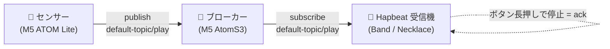

センサーが色（状態）を検知したら、MQTT 経由で Hapbeat（装着デバイス）を鳴動させ、**ボタンで止めるまでループ**させる — 病院・施設などの「必ず気付かせたい」用途向けの構成を、最短手順で組みます。

この構成は 3 つのノードで成り立ちます。

| 役割 | ハードウェア | ファーム種別（Studio） | 仕事 |
|---|---|---|---|
| **センサー** | M5 ATOM Lite + 色センサー | 周辺機器 → センサ送信機 | 色を検知して `<topic>/play` に publish |
| **ブローカー** | M5 AtomS3 | 周辺機器 → ブローカー | MQTT ブローカー本体（中継）。mDNS で自分を広告 |
| **受信機（Hapbeat）** | Band / Necklace | Hapbeat | `<topic>/play` を購読して振動・OLED 表示・アラート |

> 💡 3 ノードとも、まず[初期設定（シリアル接続 → ファーム書き込み → Wi-Fi）](/docs/tools/studio/initial-setup/)を済ませてから、このページの MQTT 設定に進みます。同じ Wi-Fi（同一 LAN）に乗っていることが前提です。

## 用意するもの

- **センサー機**（M5 ATOM Lite + 色センサー）1 台
- **ブローカー機**（M5 AtomS3）1 台
- **Hapbeat 受信機**（Band / Necklace）1 台以上
- **USB ケーブル**（データ通信対応）・**PC**（Chrome / Edge）・**2.4 GHz Wi-Fi**
- **`hapbeat-helper`** 起動済み（[初期設定](/docs/tools/studio/initial-setup/)参照）
- 受信機に入れる **Kit**（アラート用イベント。例: `alert-kit` に `urgent` / `calm`）

## 全体の流れ

1. **ブローカー**を設定（最初に立てておくと、後続の自動検出が楽）
2. **受信機（Hapbeat）**を設定（ブローカーを自動検出 → 購読トピック → アラート動作）
3. **センサー**を設定（ブローカーを自動検出 → 色 → イベントのマッピング）
4. **動作確認**（色を検知 → 受信機が鳴動 → ボタンで停止）

各ノードは「USB で繋いで設定 → Wi-Fi に乗せたら USB を外す」の繰り返しです。接続は **左サイドバー「USB Serial」欄の ＋ で機器を追加し、カードのチェックを ✔** で行います（[初期設定](/docs/tools/studio/initial-setup/)と同じ）。

---

## Part 1: ブローカーを設定する

1. ブローカー機（AtomS3）を USB 接続し、[初期設定](/docs/tools/studio/initial-setup/)に沿ってオンボーディング。
   - ファーム書き込みの「ノードの種類」で **周辺機器** → **ブローカー** を選びます。
   - Wi-Fi を設定して LAN に乗せます。
2. Devices タブで対象ブローカーを選び、**MQTT タブ**を開きます。
3. **ブローカー設定**:
   - **静的ホスト下位オクテット**（既定 `10`）と **ポート**（既定 `1883`）はそのままで構いません。
   - **適用** を押します。
4. ブローカーは mDNS（`_mqtt._tcp`）で自分を広告し始めます。本体の LCD に稼働状態（接続クライアント数・最後の publish）が表示されます。

> ブローカーは **MQTT ブローカー本体**です（外部ブローカーに繋ぐのではなく、これ自身がブローカーになります）。以降のセンサー・受信機はこれを自動検出します。

## Part 2: 受信機（Hapbeat）を設定する

1. 受信機（Band / Necklace）を USB 接続し、オンボーディング。ファーム種別は **Hapbeat**（既定）→ お手持ちのバリアントを選びます。Wi-Fi を設定します。
2. **Kit** が入っていることを確認します（アラート用イベントを含む Kit。例: `alert-kit`）。Kit タブから書き込めます。
3. **MQTT タブ**を開き、3 つのグループを設定します。
   - **ブローカー設定**: 「ブローカー自動検出」を **ON**（既定）にして **適用**。数秒で `● ブローカー接続中` になります（手動指定したい場合は自動検出を OFF にしてホスト/ポートを入力）。
   - **TOPIC（受信 topic）**: 購読するトピックをチェックします。既定の **`default-topic`** をチェックしておけば、`default-topic/play` を受信します。施設をフロア等で分けたい場合は手動でトピックを追加して選択します。**適用**（受信機は自動で再起動して反映）。
   - **アラート動作**:
     - **動作** = 「ループ（ボタンで停止）」（既定）。検知が続く限り鳴動し続け、ユーザーがボタンで止めるまで鳴ります（病院用途）。単発にしたい場合は「単発」。
     - **停止の長押し**（既定 `1000` ms）= 誤操作で止まらないよう、**ボタンを一度離してから約 1 秒長押し**で停止（ack）します。
     - **適用**（即時反映・再起動なし）。
4. （任意）**受信制限モード**: 「重要（critical）」フラグの付いた色だけ鳴らすモードです。ボタンに `limit_toggle` アクションを割り当てると、本体ボタンで 制限 ⇄ 全て を切り替えられます。OLED に現在のモード（制限/全て）を表示できます。

> 受信機の OLED 表示（レイアウト）は **Display エディタ**で作るのが確実です。手早く試したい場合は下記の [`ui-config.json` サンプル](#サンプル設定ファイル)を「設定タブ → UI Config → 参照 → 書込」で読み込めます。

## Part 3: センサーを設定する

1. センサー機（ATOM Lite）を USB 接続し、オンボーディング。ファーム種別は **周辺機器** → **センサ送信機**。Wi-Fi を設定します。
2. **MQTT タブ → ブローカー設定**: 「ブローカー自動検出」を **ON** にして **適用**（Part 1 のブローカーを検出します）。
3. **センサー タブ**で「色 → イベント」のマッピングを作ります。
   - 画面の **ライブ値**（r/g/b）を見ながら、検知したい色に対象物をかざし、各行の **RGB しきい値**を合わせます。
   - 1 行 = 1 色。各行に設定する主な項目:
     - **key**: 色のラベル（例: `red`）
     - **event_id**: 受信機の Kit にあるイベント（例: `alert-kit.urgent`）
     - **target**: 宛先アドレス（空 = 全受信機）
     - **gain**: 強度 0.0〜1.0
     - **OLED テキスト**: 受信機 OLED に出す文字（`\n` で改行可。例: `<red> alert \n occured`）
     - **重要（critical）**: ON にすると、受信機が 制限モード でもこの色は鳴ります
     - **送り先 topic**: publish 先（既定はセンサーの既定トピック。複数選択可）
   - **デバイスに保存** を押すとセンサーに書き込まれます。
4. しきい値合わせが面倒なら、下記の [`sensor-mapping.json` サンプル](#サンプル設定ファイル)を **JSON 読込** で取り込み、ライブ値を見ながら微調整するのが早道です。

## Part 4: 動作確認

1. 3 ノードとも USB を外し、Wi-Fi（同一 LAN）に乗っている状態にします。Helper が mDNS で自動検出し、左サイドバーに online で並びます。
2. センサーに **赤い対象物**をかざします。
3. 期待する挙動:
   - センサーが `red` を検知 → `default-topic/play` に publish
   - ブローカーが中継（LCD の publish カウントが増える）
   - 受信機が受信 → Kit の `alert-kit.urgent` を再生し、OLED に `<red> alert / occured` を表示、**ボタンで止めるまでループ**
   - 受信機のボタンを **一度離してから約 1 秒長押し** → アラート停止（ack）
4. Studio の **通信フロー図**（MQTT タブ）で、送信元・トピック・最後のイベントを可視化できます。

---

## サンプル設定ファイル

すぐ試せる雛形を配布しています。ダウンロードして編集し、Studio から読み込んでください。

- **センサーマッピング**: [`sensor-mapping.json`](/samples/mqtt-alert/sensor-mapping.json)（`red`=urgent/critical、`blue`=calm の 2 色例）
  → センサー タブの **JSON 読込** で取り込み、ライブ値を見て RGB しきい値を微調整。`event_id` は受信機の Kit に合わせて変更。
- **受信機の表示レイアウト**: [`ui-config.json`](/samples/mqtt-alert/ui-config.json)（名前・接続状態・電池・制限モード表示の例）
  → 設定タブ → **UI Config → 参照 → 書込**。本格的に作る場合は Display エディタで編集 → Export を推奨。

> ⚠️ サンプルは現行 Studio 版（v0.2.0 系）の形式です。`event_id` は配布物に依存しないので、ご自分の Kit のイベント名に置き換えてください。

## トラブルシュート

| 症状 | 対処 |
|---|---|
| 受信機が `ブローカー接続中` にならない | 同一 LAN か確認 / ブローカーが起動し mDNS 広告しているか（LCD）/ 自動検出を OFF にして手動でホスト・ポート入力 |
| センサーを検知しても受信機が鳴らない | センサーの **送り先 topic** と受信機の **購読 topic** が一致しているか（既定はどちらも `default-topic`）/ `event_id` が受信機の Kit に存在するか / `target` が受信機のアドレスに合うか（空=全台） |
| すぐ止まる / 止まらない | アラート動作が「ループ」か / 「停止の長押し」時間 / ボタンは**一度離してから**長押し |
| 制限モードで鳴らない色がある | その色の **重要（critical）** が ON か。critical 以外は制限モードでは鳴りません |
| 同じ色で連続して鳴りすぎる | センサー行の **debounce_ms** を上げる |

実装ノート: センサー/受信機/ブローカーの設定 UI は `src/components/devices/NodeConfigSections.tsx`（`MqttConfigSection` / `SensorMappingSection` / `BrokerConfigSection`）。コマンド仕様は contracts の `specs/serial-config.md`（`set_broker_host` / `set_recv_topics` / `set_alert_mode` / `set_sensor_mapping`）と `specs/mqtt-transport.md`（ブローカー検出・payload・アラートのライフサイクル）を参照。
